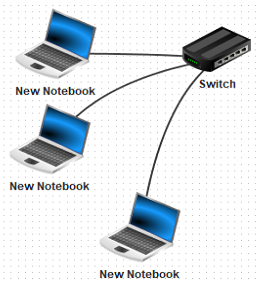
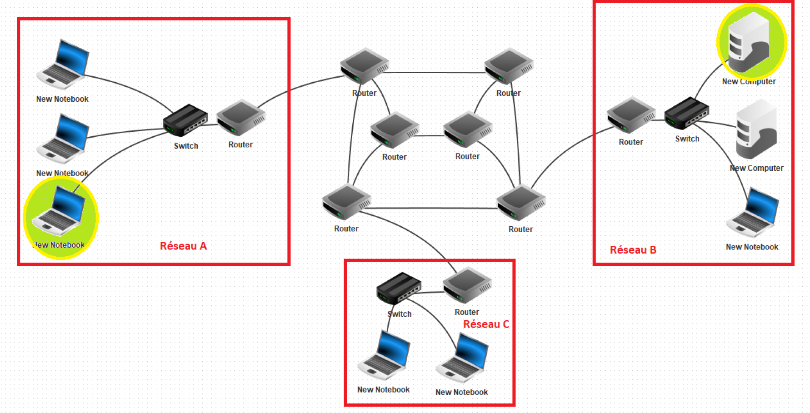

Avant de parler du **Web**, il faut peut-être clarifier la différence avec **Internet**

## Qu'est-ce qu'un réseau informatique ?

>Un **réseau informatique** est un ensemble d'équipements informatiques reliés entre eux de façon à pouvoir échanger des informations. Le **switch** (commutateur) permet de relier entre eux les appareils d'un même réseau.

## Qu'est-ce qu'Internet ?

• **Internet** est lui le réseau informatique mondial accessible au public. Il permet donc de faire communiquer entre eux les réseaux informatiques qui y sont connectés. Internet est donc un **réseau de réseaux informatiques.** Ces réseaux sont reliés entre eux par l'intermédiaire de **routeurs** qui permettent le transport des messages d'un réseau à l'autre. Internet permet donc de faire communiquer deux machines qui ne sont pas sur le même réseau.

• Si l'un des ordinateurs du réseau A veut consulter une page Web accessible via le serveur situé sur le réseau B, une communication va devoir s'établir entre le réseau A et le réseau B

Pour permettre cette communication, plusieurs règles de fonctionnement ont été édictées : les **protocoles**. Cette communication devra passer par des équipements particuliers qu'on nomme les **routeurs** : ce sont des ordinateurs dont la tâche est de faire transiter les communications.

Comme on le voit sur le schéma, il n'existe pas de chemin unique pour passer du réseau A au réseau B.

• Une Box fait office à la fois de switch et de routeur.

## Le Web, un ensemble de documents hypertextes

• Le Web est **l'une** des applications qui utilisent Internet pour transmettre leurs données d'une machine à une autre.
Il existe d'autres applications qui utilisent internet, comme les différentes applications de messagerie, le pair-à-pair / peer-to-peer / P2P, qui peuvent être basées sur d'autres protocoles.

• De façon fondamentale, le Web est constitué de l'ensemble des documents hypertextes (pages 
[HTML](Séance_2_présentation_HTML.md) ) auxquels il donne accès : on relie un document à un autre à l'aide d'un lien qu'on peut utiliser pour basculer vers un nouveau contenu hypertexte sans avoir à parcourir l'ensemble du document initial.

• Le Web a vu le jour en Suisse, en 1989 au CERN (European Organization for Nuclear Research) sous l'impulsion de Tim Berners-Lee, un chercheur Britannique.
Internet existait déjà ( le mot apparait en 1983 )... [plus d'infos historiques](Aperçu_Historique.md)

